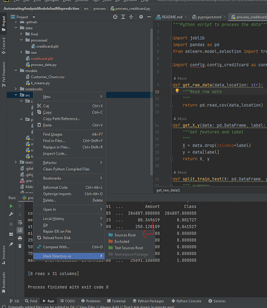

# Automating Analysis Models And Misprediction

Automating The Analysis Of Model Faults And Mispredictions.

The steps we will take in order to implement our solutions are:
1. First we will gather the data and preprocess the data.
2. Choose the relevant features from the datasets.
3. Models selection - choose classification algorithms (SVM) and clustering algorithms (k-means).
4. Training the models.
5. Tune the models and if needed to improve them.
6. Evaluate the models and compare between the two models. Conclude which of the two is better in prediction terms for our datasets.

# Data bases links:
1. https://www.kaggle.com/datasets/blastchar/telco-customer-churn
2. https://www.kaggle.com/datasets/mlg-ulb/creditcardfraud

# Notes!
1. For data csv files we use Git’s Large File System (Git LFS)
2. Make sure that when run the code, the src folder is set to the working directory:

